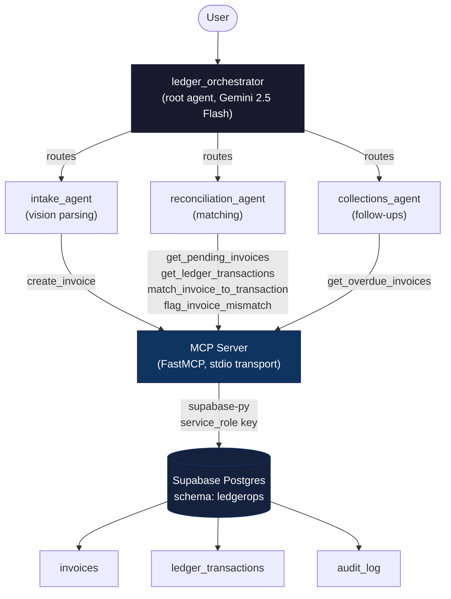

# LedgerOps

**AI-powered invoice reconciliation for small businesses, built with Google ADK.**

Submitted to the Kaggle "AI Agents: Intensive Vibe Coding Capstone Project" — Agents for Business track.

---

## The Problem

Small businesses and freelancers lose hours every week manually matching invoices against bank transactions, and overdue payments slip through the cracks because nobody is systematically tracking them. This isn't a lack of effort — it's a lack of tooling. Accounting software handles bookkeeping, but the actual *reconciliation* work — "does this invoice correspond to a real payment, and if not, why?" — is still mostly manual, repetitive, and error-prone.

The cost is real: delayed cash flow visibility, missed collections on overdue invoices, and hours of skilled time spent on work that's fundamentally pattern-matching.

## The Solution

LedgerOps is a multi-agent system that automates the full invoice lifecycle — from intake to reconciliation to collections — using Google's Agent Development Kit (ADK) and the Model Context Protocol (MCP).

A central orchestrator routes incoming requests to one of three specialist agents, each scoped to a single responsibility with least-privilege access to only the tools it needs:

| Agent | Responsibility | Tools it can access |
|---|---|---|
| **`ledger_orchestrator`** | Root agent. Interprets user intent and delegates to the right specialist. | `transfer_to_agent` (built-in ADK routing) |
| **`intake_agent`** | Parses uploaded invoice/receipt images using Gemini's native vision capabilities, extracts structured data (vendor, amount, due date, invoice number), and creates a new invoice record. | `create_invoice` |
| **`reconciliation_agent`** | Matches pending invoices against ledger transactions within a relevant date window. Confirms matches or flags discrepancies with a clear reason. | `get_pending_invoices`, `get_ledger_transactions`, `match_invoice_to_transaction`, `flag_invoice_mismatch` |
| **`collections_agent`** | Identifies overdue invoices and drafts follow-up emails with tone scaled to days overdue. Never sends emails automatically — drafts are presented to a human for review. | `get_overdue_invoices` |

This division of labor isn't just architectural tidiness — it's a deliberate security boundary. `collections_agent`, for example, can *read* overdue invoices but has no ability to modify any data, because there's no legitimate reason for an email-drafting agent to have write access to financial records.

## Architecture



Every agent communicates with Supabase exclusively through the MCP server — no agent has a direct database connection. This means all access is funneled through one auditable, validated layer, regardless of which agent is calling it.

## Tech Stack

- **Google ADK** (Python) — multi-agent orchestration, sub-agent routing
- **Gemini 2.5 Flash** — reasoning, tool-calling, and native vision (invoice parsing)
- **FastMCP** — MCP server implementation exposing 6 tools over stdio transport
- **Supabase (Postgres)** — data layer, isolated in a dedicated `ledgerops` schema
- **python-dotenv** — environment/secrets management

See `requirements.txt` for exact pinned versions.

## Security Features

This was a deliberate focus area, not an afterthought:

**Least-privilege tool access.** Each agent's `McpToolset` is configured with a `tool_filter` restricting it to only the tools its job requires. `intake_agent` can create invoices but never read or modify existing ones. `collections_agent` can only read overdue invoices — it has zero write access to any table. `reconciliation_agent` is the only agent that can mark invoices as matched or mismatched.

**Input validation on every MCP tool.** Before any tool touches the database:
- UUIDs are validated against a strict format regex
- Dates are validated and normalized to ISO-8601
- Monetary amounts are bounded (must be positive, capped at a sane maximum)
- Free-text fields (e.g. mismatch reasons) have length limits

Malformed input is rejected with a clear `ValueError` before it ever reaches Supabase.

**Row Level Security at the database layer.** All `ledgerops` tables have RLS enabled with explicit policies restricting access to the `service_role` only. The `anon` and `authenticated` roles are explicitly revoked from these tables — even if a client-side key were exposed, it could not read or write invoice data directly. All access must go through the validated MCP tool layer.

**Audit logging.** Every write operation (`create_invoice`, `match_invoice_to_transaction`, `flag_invoice_mismatch`) writes an entry to `ledgerops.audit_log` recording the acting agent, the action taken, the affected invoice, structured details, and a timestamp. This gives a complete, queryable trail of what each agent did and when — verified working in production testing.

**Secrets management.** `SUPABASE_SERVICE_KEY` and `GOOGLE_API_KEY` live only in a local `.env` file, which is git-ignored. The service role key never reaches the frontend and is never logged or printed to stdout (stdout is reserved exclusively for MCP's JSON-RPC protocol stream — all diagnostic output is routed to stderr).

## Setup Instructions

These assume a fresh clone on Windows (PowerShell).

### 1. Clone and set up the environment

```powershell
git clone <your-repo-url>
cd ledgerops
python -m venv venv
venv\Scripts\Activate.ps1
pip install -r requirements.txt
```

### 2. Configure environment variables

Create a `.env` file in the project root:

```
GOOGLE_API_KEY=your_gemini_api_key
SUPABASE_URL=your_supabase_project_url
SUPABASE_SERVICE_KEY=your_supabase_service_role_key
```

Get a Gemini API key at [aistudio.google.com/apikey](https://aistudio.google.com/apikey). Get your Supabase URL and service role key from your project's **Settings → API** page.

### 3. Set up the database

Run the following in your Supabase project's SQL editor:

```sql
create schema if not exists ledgerops;

create table ledgerops.invoices (
  id uuid primary key default gen_random_uuid(),
  vendor_name text not null,
  invoice_number text,
  amount numeric not null,
  due_date date,
  status text default 'pending',
  matched_transaction_id text,
  mismatch_reason text,
  created_at timestamptz default now()
);

create table ledgerops.ledger_transactions (
  id uuid primary key default gen_random_uuid(),
  description text,
  amount numeric not null,
  transaction_date date,
  reference text,
  created_at timestamptz default now()
);

create table ledgerops.audit_log (
  id uuid primary key default gen_random_uuid(),
  agent_name text not null,
  action text not null,
  invoice_id uuid,
  details jsonb,
  created_at timestamptz default now()
);

alter table ledgerops.invoices enable row level security;
alter table ledgerops.ledger_transactions enable row level security;
alter table ledgerops.audit_log enable row level security;

create policy "service_role_full_access_invoices" on ledgerops.invoices
  for all to service_role using (true) with check (true);
create policy "service_role_full_access_transactions" on ledgerops.ledger_transactions
  for all to service_role using (true) with check (true);
create policy "service_role_full_access_audit" on ledgerops.audit_log
  for all to service_role using (true) with check (true);

revoke all on ledgerops.invoices from anon, authenticated;
revoke all on ledgerops.ledger_transactions from anon, authenticated;

grant usage on schema ledgerops to anon, authenticated, service_role;
grant all on all tables in schema ledgerops to anon, authenticated, service_role;
```

**Important — easy to miss:** Supabase only exposes the `public` schema to the Data API by default. Go to **Project Settings → Data API → Exposed schemas** and add `ledgerops` to the list, or the MCP server will fail with `"Invalid schema: ledgerops"`.

### 4. Run the system

```powershell
adk web agents
```

Open the URL shown (typically `http://127.0.0.1:8000`). Start a new session and try:

- `Here's an invoice to add` (attach an invoice/receipt image)
- `Reconcile my pending invoices against this week's ledger transactions`
- `Check for overdue invoices and draft follow-up emails`

## Project Structure

```
ledgerops/
├── agents/
│   ├── __init__.py            # Exposes root_agent for `adk web` discovery
│   ├── agent.py                # ledger_orchestrator — root agent, routes to specialists
│   ├── intake_agent.py         # Vision-based invoice parsing → create_invoice
│   ├── reconciliation_agent.py # Invoice/transaction matching, mismatch flagging
│   └── collections_agent.py    # Overdue invoice detection, email drafting
├── mcp_server/
│   └── server.py               # FastMCP server: 6 tools, validation, audit logging
├── requirements.txt
├── .env                        # Not committed — see Setup Instructions
└── README.md
```

## Limitations & Future Work

- **Gemini free-tier rate limits** (20 requests/day) constrained iterative testing during development. The architecture is provider-agnostic at the model layer, so moving to a paid tier or a different model is a config change, not a redesign.
- **Local development only.** The system currently runs via `adk web` for local testing. Deploying the MCP server and ADK agents to Cloud Run is a natural next step — the MCP server is already a standalone process with no local-filesystem dependencies, which makes it deployment-ready.
- **`collections_agent` drafts but does not send emails.** This is by design — invoice collections is a context where a human should review tone and content before anything reaches a vendor. A future version could integrate with an email-sending MCP tool behind an explicit human-approval step.
- **Matching logic is rule-based reasoning by the LLM**, not a dedicated fuzzy-matching algorithm. This works well for clear cases but could be strengthened with a hybrid approach (deterministic pre-filtering + LLM judgment for ambiguous cases) at scale.